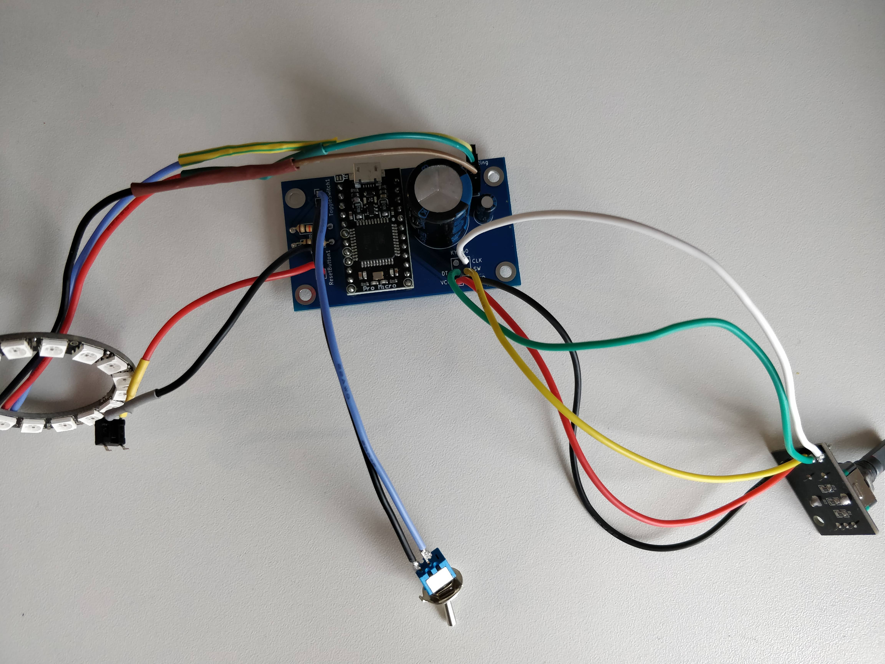
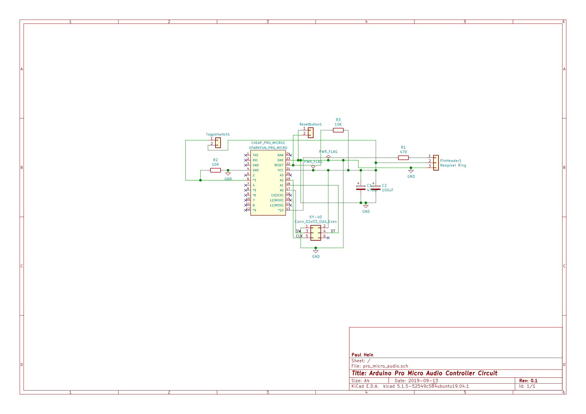

This is an Arduino Pro Micro Volume Knob following the following example.

https://www.heise.de/select/make/2019/2/1556001541578799

Troubleshooting:
If your Pro Micro does not want to be programmed do the following:

Verify the correct upload port and set it in the platformio.ini file.
(Unplug the device check the which devices are under /dev/tty:
    ls /dev/tty*
And replug the device)

If programming still fails, wait while it is uploading and use something metal and connect RST and GND pin for a short while. This reset should be enough to upload the latest Arduino files onto the Board and should work now after that without an Reset.

PCB Layout
------------------

The PCB itself was designed in KiCaD and has the following design:

It uses additional features of a possible reset button.
And a free toggle Button to connect and do interesting stuff. (Select in grub the used os to boot or other such things)

TODO
-------------------

* Implement functionality to select windows in grub (arrow down, arrow down, enter) after device was switched on after 5 seconds it will trigger (depends on grub timeout)
    * Do this only if the switch was flipped into the windows position
* Better documentation
